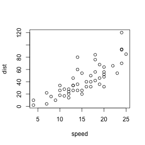
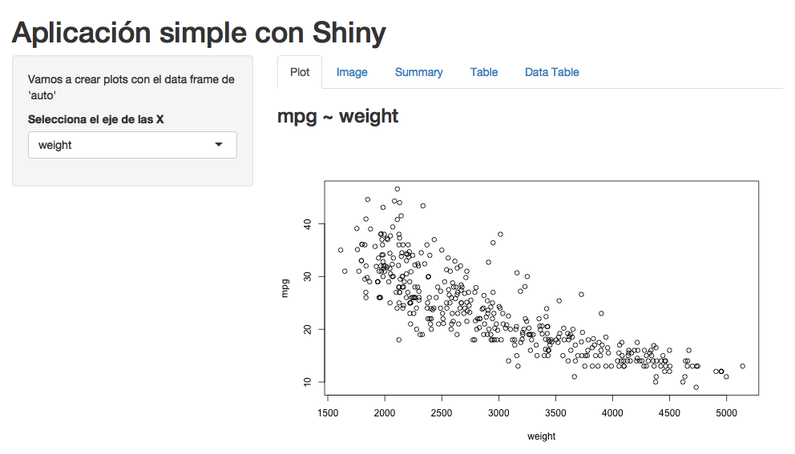

PresentacionFinal
========================================================
author: Juan Gabriel Gomila
date: 21 de Enero de 2018
autosize: true
transition-speed: slow
transition: rotate
font-family: Arial
css: custom.css

First Slide
========================================================
transition: concave
incremental: true
class: my_class

For more details on authoring R presentations please visit <https://support.rstudio.com/hc/en-us/articles/200486468>.

- Bullet 1
- Bullet 2
- Bullet 3

Slide With Code
========================================================
id: code_slide

```r
summary(cars)
```

```
     speed           dist       
 Min.   : 4.0   Min.   :  2.00  
 1st Qu.:12.0   1st Qu.: 26.00  
 Median :15.0   Median : 36.00  
 Mean   :15.4   Mean   : 42.98  
 3rd Qu.:19.0   3rd Qu.: 56.00  
 Max.   :25.0   Max.   :120.00  
```

Slide With Plot
========================================================
title: false


Mi primera imagen
========================================================


Dos columnas
========================================================
left: 40%

**Columna 1**

- Esta es una transparencia con dos columnas
    - Esta columna tiene texto
    - La siguiente columna tiene imagen
    - [Go to Slide](#/code_slide)
    - <http://juangabrielgomila.com>

***

**Columna 2**

 
